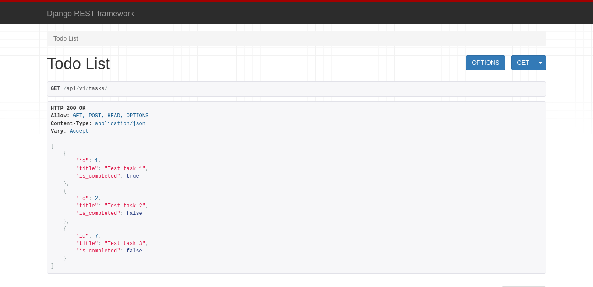
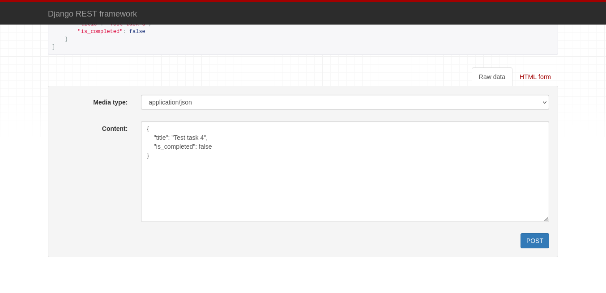
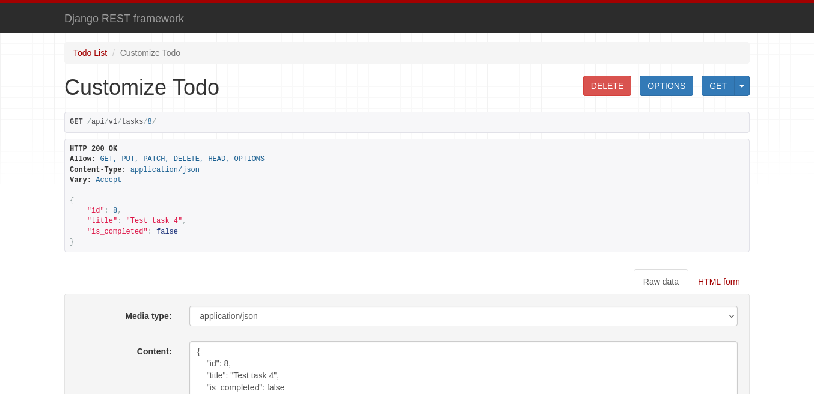
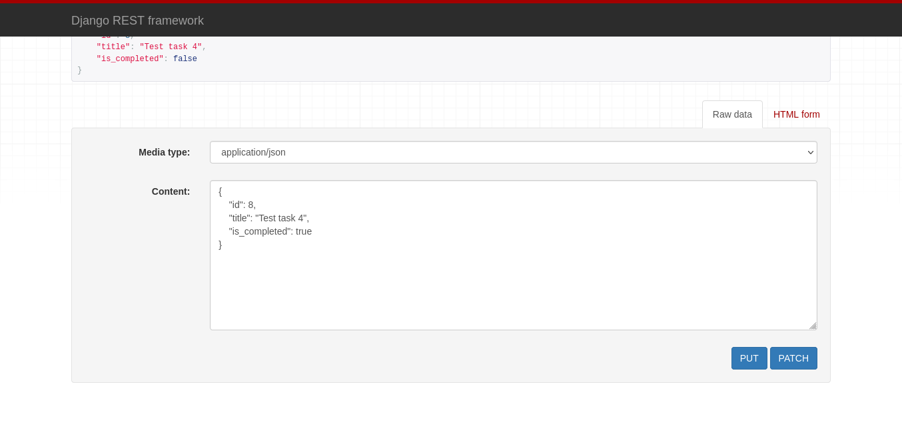

# Waterdip AI Backend Assignment

## Run Locally

Clone the project

```bash
  git clone https://github.com/suraj-py/waterdip-ai-assignment.git
```

Go to the project directory

```bash
  cd waterdip-ai-assignment
```

Create virtual environment

```bash
  pipenv shell
```

If you don't have pipenv, install it using pip

```bash
  pip3 install pipenv
```

Install dependencies, this will install all require packages from Pipefile.lock

```bash
  pipenv sync
```

Start the server

```bash
  python manage.py runserver
```

## Screenshots

- Now visit <http://127.0.0.1:8000/api/v1/tasks> to view all tasks.



- Now visit <http://127.0.0.1:8000/api/v1/tasks> to add new task.



- Now visit <http://127.0.0.1:8000/api/v1/tasks/{id}> to view single task.



- Now visit <http://127.0.0.1:8000/api/v1/tasks/{id}> to edit or delete single task.


